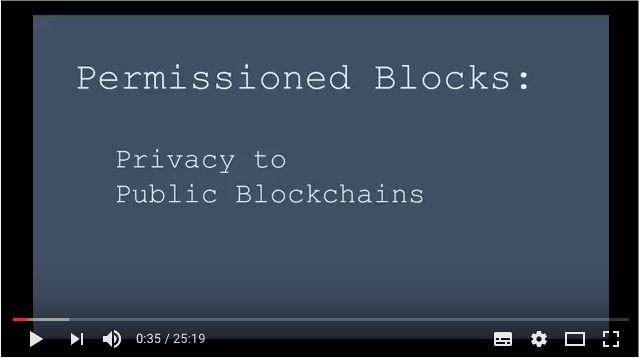

# Permissioned Blocks - Bringing Privacy to Public Blockchains

The white paper (still in progress) that details the engineering design decisions:

[White Paper - Permissioned Blocks](https://github.com/autocontracts/permissioned-blocks/blob/master/whitepaper.md) 

 

Demo Highlights:

- 100% privacy of smart contract functional state information.
- Max throughput of 10,000 transactions per second (using Tendermint consensus engine).
- No gas processing fees.
- Decentralised solution using a folk of [IPFS](https://ipfs.io/) for the secure storage of smart contract state.
- Compatible with any Turing Complete blockchain (e.g. [Ethereum](https://www.ethereum.org/), [Hyperledger](https://www.hyperledger.org/)). Decoupled and modular design.
- Multi user/role security capability model.  

